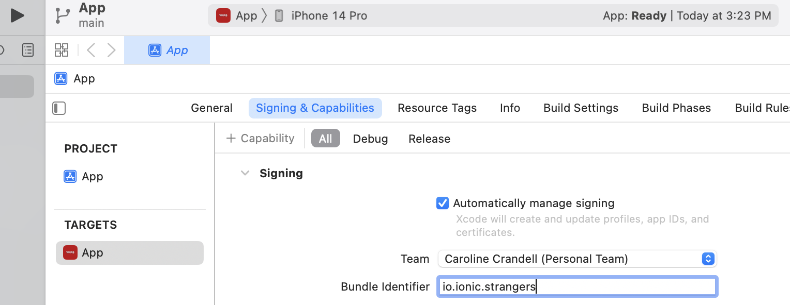

# We're Not Really Strangers

**What does this app do and why?**

The We're Not Really Strangers (WNRS) passion project is a mobile app built using the Ionic framework and React for the frontend. It came about because the creator is an avid fan of the card game [We're Not Really Strangers](https://www.werenotreallystrangers.com/) and wanted a portable way to play the game with her friends without carrying the physical decks with her all over New York City. The physical decks are growing in popularity in the US, however, they have yet to ship abroad in an affordable and timely manner. As the creator studied in the UK, she constantly needed to order games to her apartment in the US and then ship them separately to her friends all over Europe. This inspired her to create a mobile app with the intention to launch the app on app stores across the globe, to be played digitally and internationally.

<!-- <video src='support/WNRS.mov' ></video> -->

Through this app, users are able to:

- Navigate through the main menu to select their expansion pack of choice
- Swipe back and forth through individual cards in each deck

**How the app is organised**

- **.gitignore** - indicates which files to omit from this GitHub repository, such as the `ios` and `build` folders
- **Assets.xcassets folder** - (in the `.gitignore`) contains brand materials such as the icon of the app for various screen sizes and devices
- **build folder** - (in the `.gitignore`) contains files to deploy the app locally
- **images folder** - (in the `.gitignore`) contains images for the splash page of the app
- **ios folder** - (in the `.gitignore`) contains files to launch the app on an iOS device
- **node_modules folder** - (in the `.gitignore`) contains the dependencies to run the app
- **public** - contains the static files, including `index.html`
- **src** - contains all of the functionality and design of the app
- **support folder** - contains the media files for this `README` file
- **capacitor.config.json** - contains high-level code for Capacitor tooling
- **ionic.config.json** - contains code for global configuration 
- **package-lock.json** - (in the `.gitignore`) contains list of what dependencies are installed
- **package.json** - contains instructions for what dependencies `npm` needs to install
- **README** - this document, providing background information for the app
- **tsconfig.json** - contains code for compiler options

*For copyright reasons, I am unable to upload all files to this repository, as I do not own the WNRS content. As such, I have uploaded sample data instead.

**Step-by-Step on how to run the app (currently macOS only)**

First clone this app repository onto your computer. Open your Terminal and navigate to where you would like to download the source code. Then for `SSH`, run:

```js
git clone git@github.com:cecrandell/strangers.git
```

Or for `HTTPS`, run:

```js
git clone https://github.com/cecrandell/strangers.git
```

Now that you have downloaded the app onto your computer, please ensure that you have [Ionic](https://ionicframework.com/docs/intro/cli) and [npm](https://docs.npmjs.com/downloading-and-installing-node-js-and-npm) installed on your computer. Then navigate to the root folder in your Terminal and run:

```js
npm install
```

To run locally, run:

```js
ionic serve
```

To run in an iOS simulator, run:

```js
ionic build
```

Then run:

```js
ionic cap add ios
```

To open in Xcode, run:

```js
ionic cap open ios
```

Once you are in Xcode, you will need to configure your Apple ID as your Team and change your Bundle Identifier from `io.ionic.starter` to `io.ionic.<your-first-name>` (see screenshot below for an example):



Then select your preferred simulator device and press the play button to run the app in a simulator.

# Running app with sample data

As I do not own the WNRS content, this repository only contains sample data. For the version of the mobile app that is running in the demostration video above, there are steps and screenshots below of the actions that need to be taken.

To run the app with the WNRS content, you could need to obtain the JSON files for each deck and uncomment/comment the following code before building:


**Technologies Used**

- Ionic
- React
- JavaScript
- Typescript
- HTML
- CSS

**Developer**

- Caroline Crandell - cecrandell - cecrandell19@gmail.com - [LinkedIn](https://www.linkedin.com/in/carolinecrandell/)
